# Ponderada Semana 5

# 1. Fundamentação Teórica

## 1.1 Camada Física

A Camada Física é a primeira camada do modelo de referência OSI, responsável pela transmissão e receção de bits através de um meio físico. Define as características elétricas, mecânicas, de temporização e de procedimentos necessários para ativar, manter e desativar ligações físicas entre sistemas de comunicação.

## 1.2 Camada de Enlace de Dados

A Camada de Enlace de Dados é a segunda camada do modelo Modelo OSI, situada entre a camada física e a camada de rede. Ela assegura a transferência confiável de dados entre dispositivos diretamente conectados, controlando erros, fluxo e acesso ao meio físico de transmissão.

>**Framing:** encapsula os dados recebidos da camada de rede em unidades chamadas quadros(frames).

## 1.3 Cabeamento de Par Trançado

O cabo de par trançado, conhecido como UTP (UnShielded Twisted Pair, ou par trançado sem blindagem) consiste em um par de fios, normalmente de cobre, trançados e revestidos com PVC, que é um material isolante. O conjunto de pares é agrupado dentro de um revestimento externo de modo que todos os fios juntos têm a aparência de um único cabo.Por fim, os fios são trançados para evitar os efeitos indesejáveis da interferência elétrica que pode surgir durante a transmissão de sinais devido à proximidade dos fios.

[Fonte](https://materialpublic.imd.ufrn.br/curso/disciplina/4/19/2/7)

## 1.4 Topologia Física de Redes

A topologia de rede refere-se à disposição física e lógica dos nós e conexões em uma rede de computadores, que controla como os dados fluem entre os dispositivos.

> **Nó** : É um ponto de conexão em uma rede que pode enviar e receber dados. Nós incluem dispositivos físicos e equipamentos de comunicação, como computadores, telefones, dispositivos de IoT, roteadores, switches, repetidores e hubs. Cada nó desempenha um papel na transmissão, recebimento ou encaminhamento de dados na rede.

Uma topologia física de rede descreve a localização de cada componente na rede e como eles estão fisicamente conectados. A topologia lógica descreve como os dispositivos de rede parecem estar conectados uns aos outros e como os dados fluem pela rede, independentemente das conexões físicas. 

[Fonte](https://www.ibm.com/br-pt/think/topics/network-topology)

### 1.4.1 Topologia Estrela 

A rede é organizada de forma que os nós sejam conectados a um hub central, que atua como um servidor. O hub gerencia a transmissão de dados pela rede. Ou seja, qualquer dado enviado pela rede viaja pelo hub central antes de terminar em seu destino.

Figura 1 - Topologia Estrela

    

        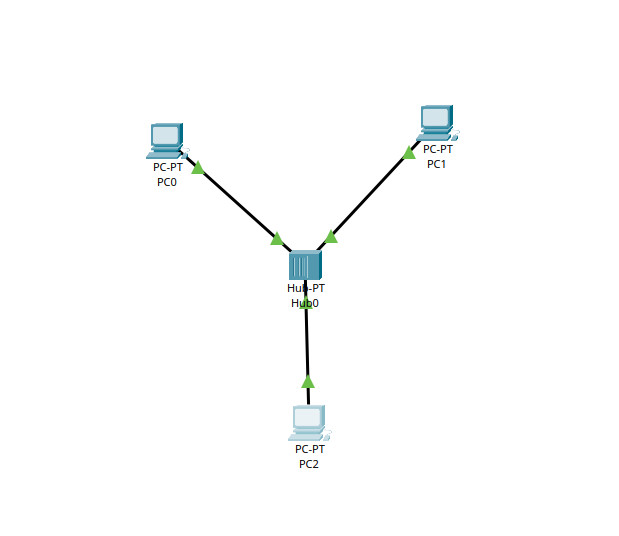
    

Fonte: O autor (2026)

[Fonte](https://www.internationalit.com/post/topologia-de-rede-conhe%C3%A7a-os-principais-tipos)

## 1.5 Conceito de Meio Compartilhado

Meio compartilhado é um canal físico de comunicação utilizado simultaneamente por vários dispositivos de rede, onde a transmissão precisa ser coordenada para evitar interferência ou colisões. Esse conceito aparece no HUB, tendo em vista que quando se tem o Hub como centralizador de envio de mensagens é transmitido para todos os dispositivos  

> **HUB:** Ao montar uma rede local com dispositivos conectados através de um hub, qualquer mensagem enviada por um dispositivo será transmitida para todos os dispositivos conectados.

## 1.6 Unidades de Dados do Protocolo (PDU)

O termo Unidade de Dados do Protocolo (PDU — Protocol Data Unit) refere-se ao formato específico de dados utilizado em cada camada do processo de comunicação em rede. Cada camada da arquitetura de rede adiciona suas próprias informações de controle aos dados transmitidos, permitindo que os dispositivos consigam identificar origem, destino e características da comunicação.

No contexto das redes Ethernet e da camada de enlace de dados, a PDU é chamada de quadro (frame). Esse quadro contém informações essenciais para a entrega correta da mensagem, como os endereços MAC de origem e destino, além do campo de dados que transporta as informações geradas pelas camadas superiores.

Durante o processo de transmissão, o dispositivo de origem encapsula os dados dentro desse quadro Ethernet e os envia pelo meio físico da rede na forma de sinais elétricos que percorrem o cabeamento. Os dispositivos conectados ao meio recebem o sinal transmitido e analisam o quadro para verificar se o endereço de destino corresponde ao seu próprio endereço físico.

# 2. Parte 1 — Rede com HUB e Análise de Propagação do Sinal

O cenário experimental foi composto por uma topologia simples composta por três computadores (PC0, PC1 e PC2) conectados a um hub. A interligação entre os dispositivos foi realizada por meio de cabos de par trançado, que representam um dos meios físicos mais comuns em redes Ethernet.

Nessa configuração, cada computador possui uma conexão direta com o hub, que atua como um ponto central de interligação entre os dispositivos. Esse tipo de organização caracteriza uma topologia física em estrela, na qual todos os nós da rede estão conectados a um único equipamento intermediário responsável por receber e retransmitir os sinais.

Embora a estrutura física seja organizada em estrela, o comportamento lógico da rede com hub se assemelha a um meio compartilhado, pois todos os dispositivos utilizam o mesmo canal de comunicação para transmitir e receber sinais. Dessa forma, qualquer sinal enviado por um computador é replicado pelo hub para todas as portas conectadas.

 Figura 2 — Rede com HUB e Análise de Propagação do Sinal

    

        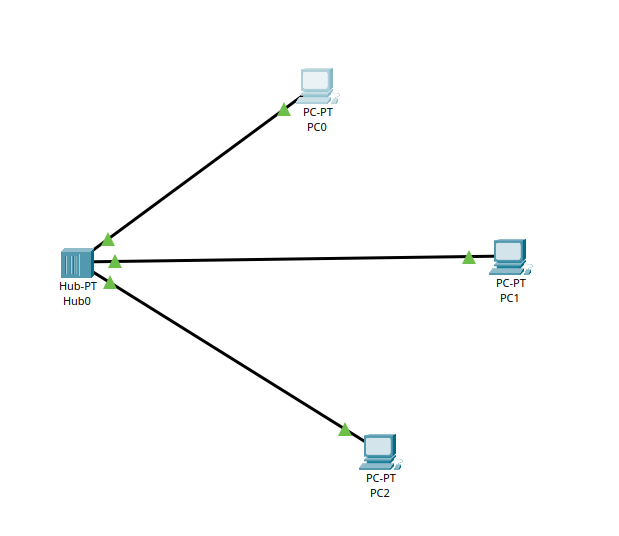
    

Fonte: O autor (2026)

## 2.1 Configuração dos Dispositivos

### Conceitos

#### Endereço IP

Consiste em quatro segmentos chamados octetos, separados por um ponto. Os números dentro de cada octeto variam de 0 a 255

- Ex. 192.168.40.39

Nenhum outro dispositivo em sua rede terá o mesmo endereço IP. Portanto, para que um dispositivo se comunique com outro, o dispositivo remetente precisa saber a localização do destino antes de começar a transmitir dados.

[Fonte](https://www.networkcomputing.com/ip-subnetting/ip-addresses-subnet-masks-and-default-gateways)

#### Máscara de rede

Uma máscara de sub-rede é uma máscara de 32 bits que divide um endereço IP em seções de rede e de host para permitir a segmentação de rede IPv4. Como o nome indica, a máscara de sub-rede é usada para subdividir uma rede em partes menores e mais gerenciáveis. 

> **E o que seria um bit?**
>
> Um **bit** (binary digit) é a menor unidade de informação em computação e redes.  
> Ele pode assumir apenas dois valores possíveis: **0 ou 1**.
>
> Quando vários bits são agrupados, eles formam sequências que representam dados, números ou endereços de rede.
>
> Por exemplo, **32 bits** significa uma sequência de **32 zeros ou uns**, como:
>
> `11111111000000000000000000000000`
>
> Esse é o endereço binário correspondente ao **255.0.0.0**.
>
> Observe que os números separados por pontos em um endereço **IPv4** são chamados de **octetos**, pois cada um representa um grupo de **8 bits**.

[Fonte](https://www.auvik.com/franklyit/blog/what-is-subnet-mask/)

### 2.1.1 Configuração PC0

Figura 3 - Configuração do IP e Máscara do PC0

    

        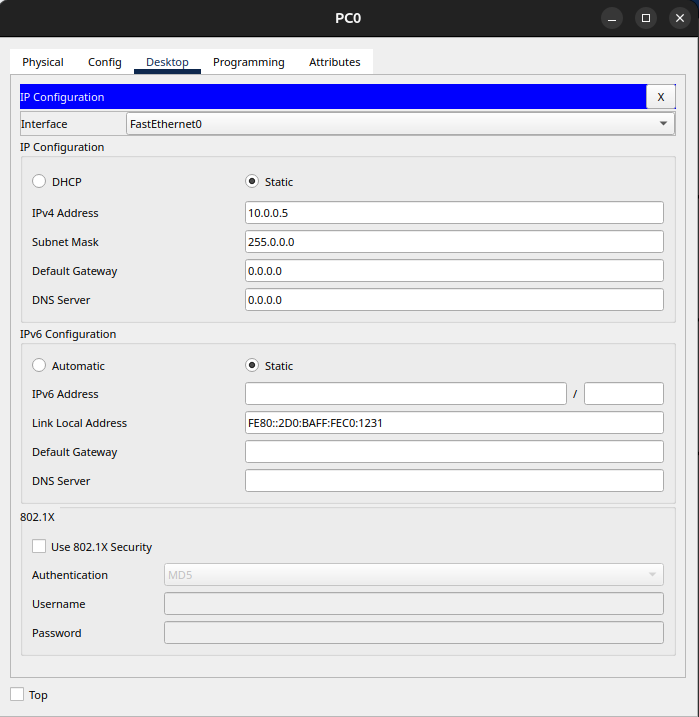
    

Fonte: O autor (2026)

### 2.1.2 Configuração PC1	

CFigura 4 - onfiguração do IP e Máscara do PC1

    

        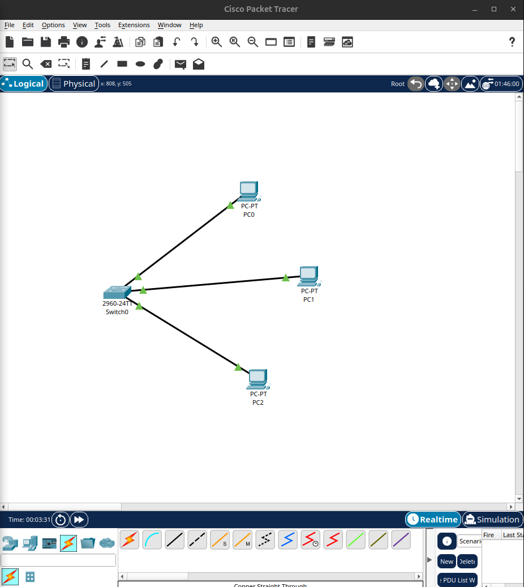
    

Fonte: O autor (2026)

### 2.1.3 Configuração PC2

Figura 5 - Configuração do IP e Máscara do PC2

    

        
    

Fonte: O autor (2026)

## 2.2 Teste de Conectividade

Com o objetivo de verificar se os dispositivos estavam corretamente configurados e se havia comunicação funcional entre os nós da rede, foram realizados testes de conectividade utilizando o comando ping entre os computadores do cenário.

Os resultados observados indicaram respostas bem-sucedidas para as requisições enviadas, demonstrando que os dispositivos estavam corretamente conectados e que a comunicação entre eles estava operacional. Dessa forma, foi possível confirmar que o cenário estava preparado para a etapa seguinte do experimento, que envolve a análise da transmissão de PDUs.

Figura 6 - Conectividade PC0 -> PC1

    

        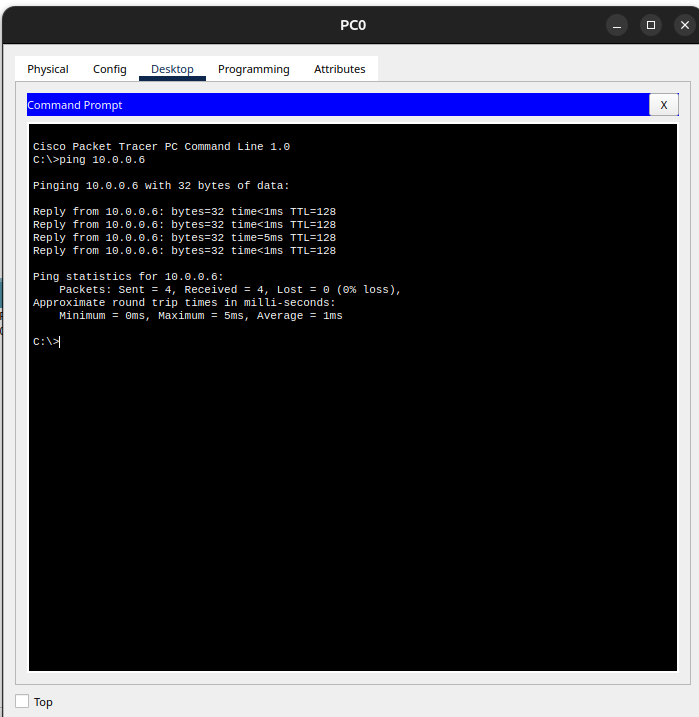
    

Fonte: O autor (2026)

Figura 7 - Conectividade PC1 -> PC2

    

        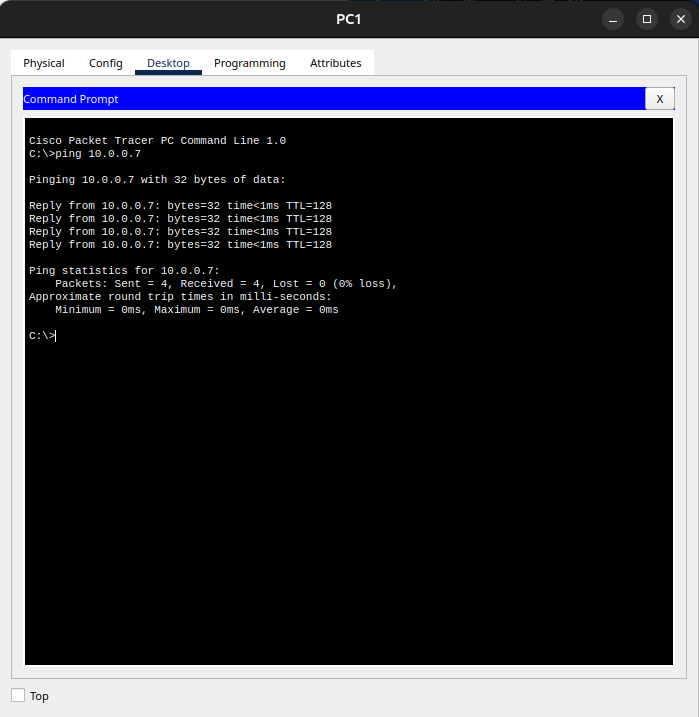
    

Fonte: O autor (2026)

## 2.3 Simulação de Transmissão com Simple PDU

Após a verificação da conectividade entre os dispositivos, foi realizada uma simulação de transmissão de dados utilizando a ferramenta Simple PDU. Nesse procedimento, foi enviada uma PDU simples do PC0 para o PC2, permitindo observar detalhadamente o caminho percorrido pelo quadro na rede e o comportamento dos dispositivos intermediários durante o processo de transmissão.

 Figura 8 - Transmissão com Simple PDU - Parte 1

    

        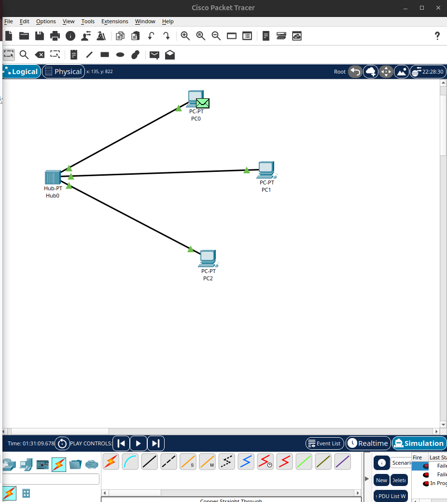
    

Fonte: O autor (2026)

 Figura 9 - Transmissão com Simple PDU - Parte 2

    

        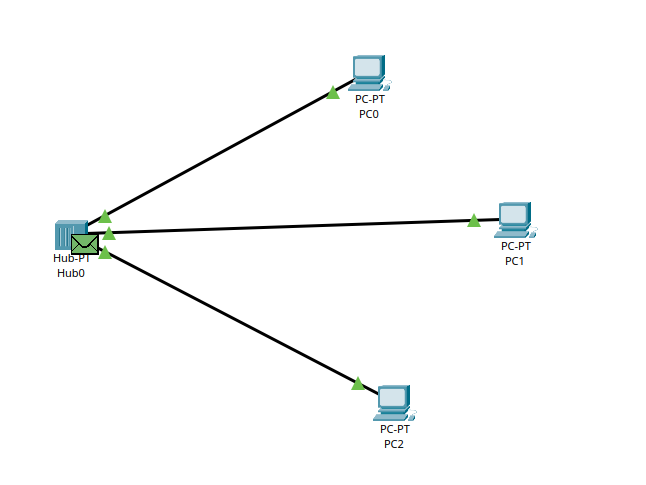
    

Fonte: O autor (2026)

 Figura 10 - Transmissão com Simple PDU - Parte 3

    

        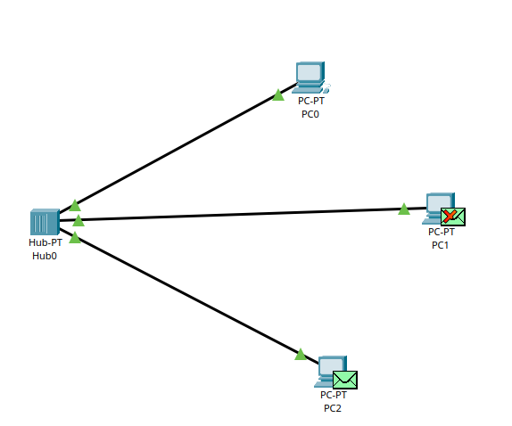
    

Fonte: O autor (2026)

 Figura 11 - Transmissão com Simple PDU - Parte 4

    

        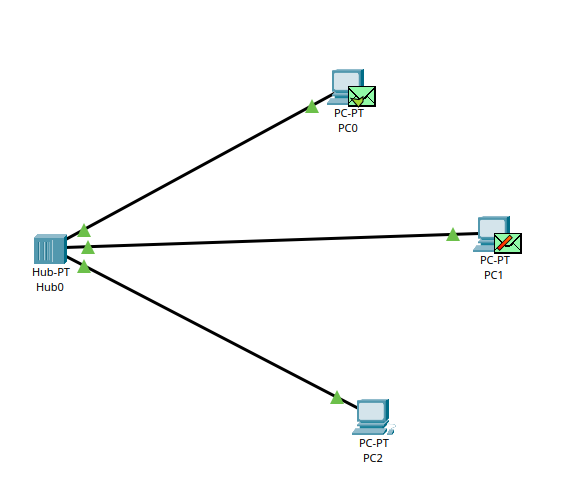
    

Fonte: O autor (2026)

Ao iniciar a simulação, o Packet Tracer demonstrou visualmente a propagação do quadro gerado pelo PC0 através do hub. Como o hub opera na camada física, o sinal elétrico recebido em uma de suas portas é replicado para todas as demais portas conectadas. Dessa forma, todos os dispositivos ligados ao hub recebem inicialmente o quadro transmitido, mesmo que apenas um deles seja o destinatário final.

Durante a simulação passo a passo, foi possível observar que os computadores conectados ao hub recebem o quadro, analisam o endereço de destino presente na estrutura do quadro Ethernet e descartam a informação caso não sejam o destinatário correspondente. Apenas o dispositivo cujo endereço corresponde ao destino processa efetivamente a mensagem recebida.

## 2.4 Análise 

### a) Por que todos os nós recebem o quadro inicialmente dentro de um hub?

Em uma rede que utiliza hub, todos os dispositivos conectados recebem inicialmente o quadro transmitido porque esse equipamento opera apenas na camada física do modelo de rede. O hub não realiza qualquer tipo de análise do conteúdo dos dados transmitidos, como endereços MAC ou informações de destino.

Quando um dispositivo envia um quadro pela rede, o sinal elétrico chega a uma das portas do hub. A partir desse momento, o hub simplesmente replica o sinal recebido para todas as demais portas conectadas, sem realizar qualquer tipo de filtragem ou decisão de encaminhamento.

Como consequência, todos os dispositivos conectados ao hub recebem o quadro transmitido. Cada computador então analisa o endereço MAC de destino presente no quadro Ethernet. Caso o endereço corresponda ao seu próprio endereço físico, o dispositivo processa a mensagem, caso contrário, o quadro é descartado.

### b) Explique como isso se relaciona ao conceito de meio compartilhado com desempenho real na camada física.

Meio compartilhado é um canal físico de comunicação utilizado simultaneamente por vários dispositivos de rede. Nesse Sentido, em redes que utilizam hubs, todos os dispositivos conectados compartilham o mesmo meio de transmissão, ou seja, utilizam o mesmo canal físico para enviar e receber sinais. Como o hub apenas replica sinais elétricos, todos os dispositivos passam a receber as transmissões realizadas por qualquer outro dispositivo conectado. Dessa forma, apenas um equipamento pode transmitir de forma eficiente em determinado momento, pois múltiplas transmissões simultâneas podem gerar colisões de sinais no meio físico.

# 3. Parte 2 — Rede com SWITCH e Comparação Física

Na segunda etapa do experimento, o hub foi substituído por um switch 2960, mantendo-se os mesmos computadores, endereços IP e cabeamento utilizados no cenário anterior. Essa alteração permitiu analisar como a transmissão de dados se comporta quando a rede passa a utilizar um dispositivo que opera na camada de enlace de dados, diferente do hub, que atua apenas na camada física.

Figura 12 — Rede com SWITCH e Comparação Física

    

        
    

Fonte: O autor (2026)

## 3.1 Estabilização das Portas

Após a substituição do hub pelo switch, foi necessário aguardar o processo de inicialização do equipamento antes da realização dos testes de conectividade.No Cisco Packet Tracer, esse processo pode ser observado pelo estado das portas do switch, que inicialmente permanecem inativas até que o dispositivo finalize sua inicialização. Após alguns instantes, as portas passam para o estado ativo, permitindo a comunicação com os dispositivos conectados.

## 3.2 Teste de Conectividade

Após a estabilização das portas foi possível iniciar os testes de conectividade utilizando o comando ping e posteriormente realizar a simulação de envio de PDUs entre os computadores.

### 3.2.1 Conectividade PC0 -> PC1

Figura 13 — Conectividade PC0 -> PC1

    

        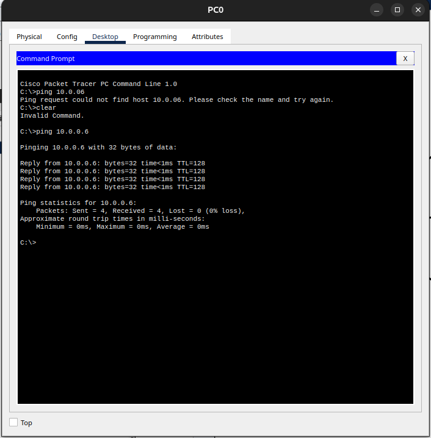
    

Fonte: O autor (2026)

### 3.2.2 Conectividade PC0 -> PC1

Figura 14 — Conectividade PC0 -> PC1

    

        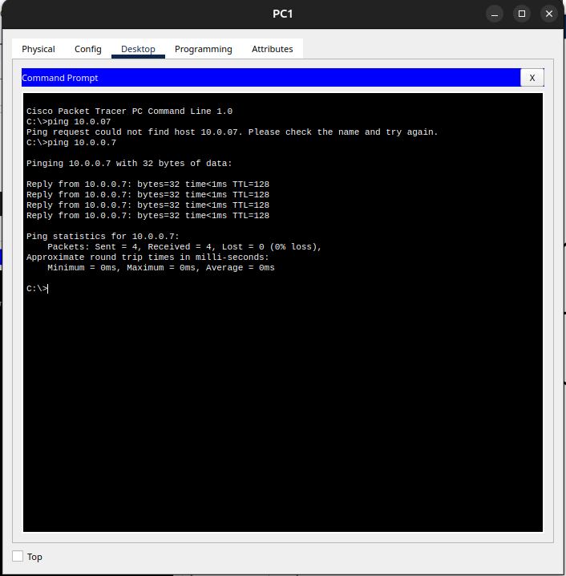
    

Fonte: O autor (2026)

## 3.3 Simulação de Transmissão com Simple PDU

Diferentemente do cenário com hub, o switch analisa as informações contidas no quadro Ethernet, especialmente os endereços MAC de origem e destino. A partir dessas informações, o equipamento utiliza sua tabela de endereços MAC para determinar qual porta deve ser utilizada para encaminhar o quadro até o dispositivo de destino.

> **MAC address**, também traduzido como endereço de controle de acesso à mídia, identifica o hardware responsável por cada interação com o meio de transmissão cabeado, óptico ou sem fio. Esse número é único, exclusivo e composto por doze dígitos, formado por seis pares hexadecimais separados.

 Figura 15 - Transmissão com Simple PDU - Parte 1

    

        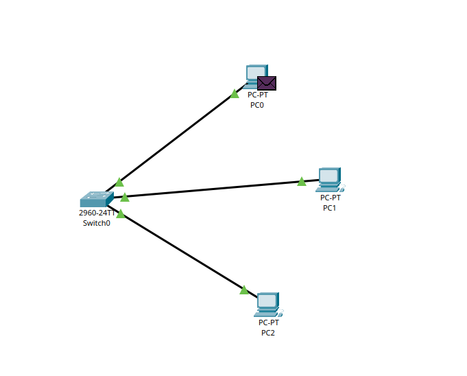
    

Fonte: O autor (2026)

 Figura 16 - Transmissão com Simple PDU - Parte 2

    

        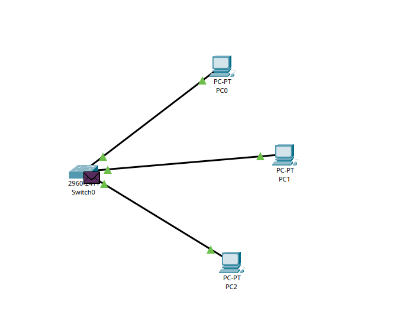
    

Fonte: O autor (2026)

 Figura 17 - Transmissão com Simple PDU - Parte 3

    

        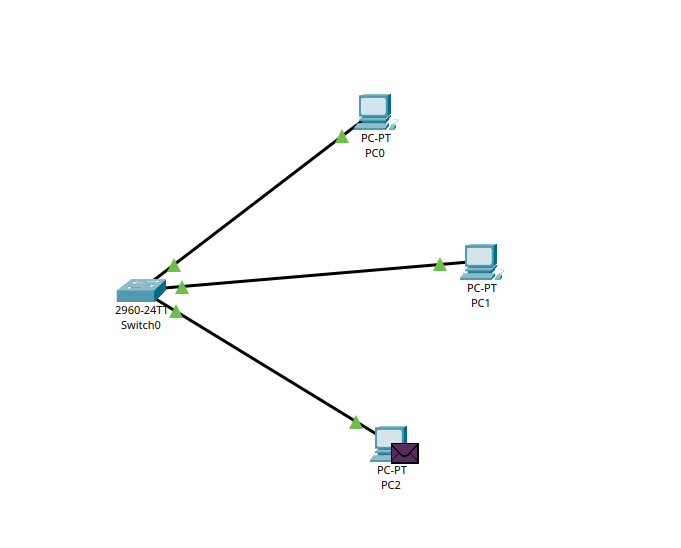
    

Fonte: O autor (2026)

 Figura 18 - Transmissão com Simple PDU - Parte 4

    

        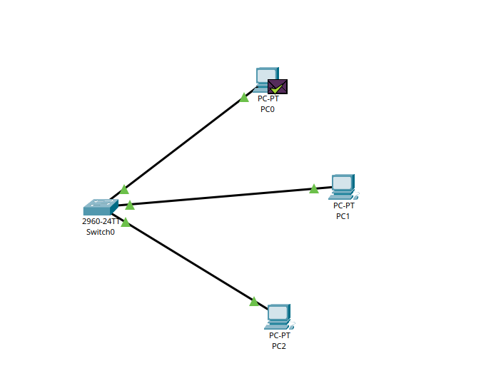
    

Fonte: O autor (2026)

Durante a simulação, foi possível observar que o quadro não é replicado para todas as portas do switch da mesma forma que ocorre em um hub. Em vez disso, o switch direciona a transmissão apenas para a interface correspondente ao dispositivo de destino, reduzindo o tráfego desnecessário na rede.

## 3.4 Análise 

### a) Compare o fluxo do sinal elétrico no switch versus hub.

A principal diferença entre o comportamento do hub e do switch está na forma como os sinais recebidos são tratados e encaminhados dentro da rede.

No caso do hub, o dispositivo atua apenas como um repetidor de sinais elétricos. Ao receber um sinal em uma porta, ele simplesmente replica esse sinal para todas as demais portas conectadas, fazendo com que todos os dispositivos recebam a transmissão independentemente de serem ou não o destino final.

Já o switch opera na camada de enlace de dados, o que permite que ele analise informações presentes nos quadros Ethernet, como os endereços MAC de origem e destino. Com base nessas informações, o switch consulta sua tabela de endereços MAC e encaminha o quadro apenas para a porta associada ao dispositivo de destino.

Dessa forma, enquanto o hub distribui o sinal para todos os nós da rede, o switch realiza um encaminhamento seletivo, direcionando os dados somente para o dispositivo correspondente.

### b) Por que agora a PDU não é propagada para todos os nós da mesma forma?

A PDU não é propagada para todos os dispositivos quando se utiliza um switch porque esse equipamento possui a capacidade de identificar o destino correto da transmissão. Ao receber um quadro, o switch verifica o endereço MAC de destino e utiliza sua tabela de encaminhamento para determinar a porta correta pela qual o quadro deve ser enviado. Esse comportamento reduz o tráfego desnecessário na rede e melhora a eficiência da comunicação entre os dispositivos.

### c) O switch elimina o meio físico compartilhado? Justifique tecnicamente.

O switch não elimina completamente o meio físico compartilhado, mas reduz significativamente seu impacto na rede. Isso ocorre porque cada porta do switch funciona como um segmento de rede independente, criando domínios de colisão separados para cada conexão.

Enquanto em uma rede com hub todos os dispositivos compartilham o mesmo domínio de colisão, em uma rede com switch cada porta representa um domínio de colisão individual. Dessa forma, transmissões realizadas entre dois dispositivos conectados a portas diferentes não interferem diretamente nas comunicações realizadas em outras portas.

Assim, embora os dispositivos ainda estejam interligados fisicamente pelo mesmo equipamento, o switch organiza o tráfego de forma mais eficiente, evitando que todas as transmissões sejam propagadas indiscriminadamente pelo meio físico.